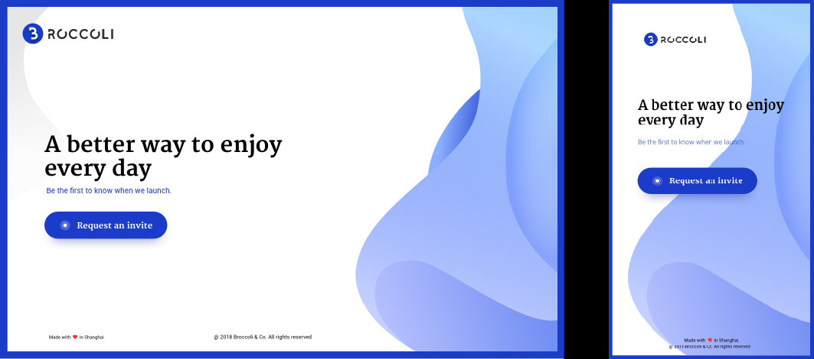

<br>
<br>

<p align="center">
  
</p>

<br>
<br>

<p align="center">
  <a href="https://github.com/waynecz/Watson">
  
  </a>
</p>

<br>

<p align="center">
  <b>
    <a href="https://broccoli.grisoso.com">Preview site online</a>
  </b>
</p>

<br>

### Project setup

```bash
#1. Parse dev.grisoso.com to your localhost
# It's important or you'll not be allowed to access images
sudo vi /etc/hosts

#...
# 127.0.0.1    dev.grisoso.com
#...

#2. Install dependencies
npm install

#3. Run dev-server
npm run serve

#4. Open http://dev.grisoso.com:8080

#5. Compiles and minifies for production
npm run build

#6. Run end-to-end tests
npm run test:e2e
```

<br>

### Pay attention

- The CDN node is Shanhai, visit from Melbourne, as a result, will have a high Ping

<br>

### Get the Design

Sketch raw file is accessible [here](./design). Remember, as well, to install fonts firstly

<br>

### Screenshots


